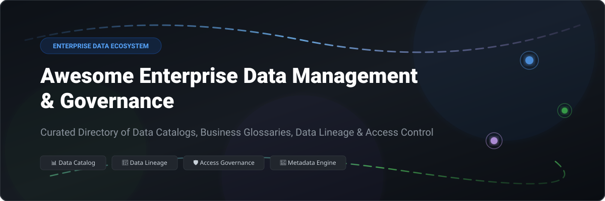

# Awesome-Enterprise-Data-Management-Governance 🏢 📊

  

  
  
  
  
  
  

---

## 🌟 Top Enterprise Data Management & Governance Ecosystem

**Curated List of Commercial Data Governance Platforms & Open-Source Data Catalog Tools** 🚀  
*Focused on Data Catalogs, Business Glossaries, Data Lineage, Data Quality, Access Governance & Metadata Management*

**Last updated: October 2026** 📅

---

### 📌 Overview & SEO Summary

Welcome to the definitive, SEO-optimized repository for **enterprise data management**, **data governance frameworks**, **open-source data catalog platforms**, and **automated metadata management tools**. As modern data stacks scale across multi-cloud environments, organizations require robust metadata solutions to maintain data quality, column-level data lineage, active data governance, and regulatory compliance (GDPR, CCPA, HIPAA).

Whether you are evaluating commercial data intelligence suites (such as *Microsoft Purview*, *Amazon DataZone*, *Collibra*, or *Alation*) or seeking enterprise-grade self-hosted open-source platforms (such as *DataHub*, *OpenMetadata*, *Apache Iceberg*, or *Apache Atlas*), this guide details market size, transparent pricing, free tier limits, and GitHub community metrics.

---

## 📑 Table of Contents

- [🏢 SaaS & Commercial Platforms](#-saas--commercial-platforms)
- [🔓 Open-Source GitHub Projects](#-open-source-github-projects)
- [🛠️ How to Contribute](#%EF%B8%8F-how-to-contribute)
- [📊 Star History](#-star-history)
- [🤝 Support & Sponsorship](#-support--sponsorship)
- [⚠️ Disclaimer](#%EF%B8%8F-disclaimer)

---

## 🏢 SaaS / Commercial Platforms

📈 **Market Intelligence & Sector Dynamics:** The global Enterprise Data Management & Governance market is estimated at **$5.5 Billion to $12.8 Billion** (projected to exceed **$20+ Billion by 2030** at a **~18.5% CAGR**). The sector is **moderately fragmented**, featuring intense competition between cloud hyperscalers (Microsoft Purview, AWS DataZone), enterprise catalog suites (Collibra, Alation, Atlan), and specialized data security & observability vendors (Immuta, Monte Carlo, Privacera), rather than a single winner-take-all monopoly.

| SaaS / Commercial Platform | Company / Owner | Valuation / Market Cap | Standard Edition Starting Price | Free Tier / Free Trial Limits | Description |
| :--- | :--- | :--- | :--- | :--- | :--- |
| **[Microsoft Purview](https://www.microsoft.com/en-us/security/business/microsoft-purview)** 🔷 | Microsoft | ~$3.90 Trillion | **$5/user/month** (Information Protection) + **$0.50/catalog hour** | **90-day free trial** (Purview solutions) & **1 TB/month free scan** (Data Map free version) | **Microsoft-native data governance** — **Data catalog, lineage, and classification** . **Integrates with Azure, Microsoft 365, and Dynamics 365** . **Data Loss Prevention (DLP)** and **Insider Risk Management** . 🛡️ |
| **[Amazon DataZone](https://aws.amazon.com/datazone/)** ☁️ | Amazon | ~$2.0 Trillion | **$0.60/data asset/month** + **$0.01/API request** | **Free tier: 1,000 API requests/month for 12 months** (1,000 assets published free for 30 days) | **AWS-native data governance** — **Data catalog, discovery, and access governance** . **Business glossary and data lineage** . **Fine-grained access control** with **AWS Lake Formation integration** . **Publish and subscribe workflows** for data sharing . 📦 |
| **[Informatica Cloud Data Governance](https://www.informatica.com/)** 🔴 | Informatica | ~$8.0 Billion | **$131,760/year** ($91.50/IPU/month base tier on AWS Marketplace) | **30-day free trial** (full access to IDMC cloud governance modules) | **Enterprise data governance** — **Data catalog, quality, and lineage** . **AI-powered recommendations** . **The most comprehensive enterprise data management platform** . 🏛️ |
| **[Collibra Data Intelligence Cloud](https://www.collibra.com/)** 🏢 | Collibra | ~$2.6 Billion | **~$170,000/year** (base subscription tier) | **20-day limited trial** (for Data Quality & Observability module; core platform requires guided demo) | **Enterprise data intelligence platform** — **Data catalog, governance, and lineage** . **Business glossary and data stewardship** . **The most comprehensive enterprise data governance platform** . 🌟 |
| **[Alation Data Catalog](https://www.alation.com/)** 🔵 | Alation | ~$1.7 Billion | **~$60,000/year** (AWS Marketplace starting tier) | **30-day Proof of Concept (POC)** (guided environment available upon request) | **Data intelligence platform** — **Data catalog with behavioral analysis** . **Collaborative data curation and governance** . **The most user-friendly enterprise data catalog** . 🔍 |
| **[Monte Carlo Data](https://www.montecarlodata.com/)** 🎲 | Monte Carlo | ~$1.6 Billion | **~$70,000/year** (Start tier - credit-based consumption model) | **14 to 28-day Proof of Concept (POC)** (2-4 weeks table subset trial) | **Data observability platform** — **Data quality monitoring and anomaly detection** . **Incident triage, root cause, and lineage** . **Up to 10 users on Start plan** . 📊 |
| **[Immuta](https://www.immuta.com/)** 🛡️ | Immuta | ~$1.0 Billion | **~$1,000/user/year** + **$5,000/connector/year** | **14-day free trial** (available via AWS Marketplace / Partner Connect) | **Data security platform** — **Dynamic data access control and policy enforcement** . **Attribute-based access control (ABAC)** . **Sensitive data discovery and masking** . 🔒 |
| **[Atlan](https://atlan.com/)** 🟣 | Atlan | ~$750 Million | **$350/month** ($4,200/year base plan for small teams) | **14-day free trial** (interactive sandbox demo upon request) | **Modern data catalog** — **Data discovery, lineage, and governance** . **Collaborative workspace for data teams** . **The most modern data catalog platform** . 💡 |
| **[Privacera](https://privacera.com/)** 🔒 | Privacera | ~$150 Million (Est.) | **~$15,000/year** (PrivaceraCloud SaaS starting plan) | **30-day free trial** (PrivaceraCloud sandbox environment) | **Data security and governance platform** — **Unified access control across multi-cloud** . **Built on Apache Ranger** . **Data discovery, classification, and masking** . 🛡️ |
| **[OvalEdge](https://www.ovaledge.com/)** 🥚 | OvalEdge | ~$50 Million (Est.) | **$100/user/month** + **$100/connector/month** | **14-day free trial** (full access sandbox demo environment) | **Data catalog and governance platform** — **Data discovery, lineage, and quality** . **Business glossary and data stewardship** . **The most accessible enterprise data catalog** . 📋 |

---

## 🔓 Open-Source GitHub Projects

*Sorted by GitHub_Stars_Count (Descending)* 🌟

- **[DataHub (LinkedIn)](https://github.com/datahub-project/datahub)**   
  **Extensible open-source metadata platform for data discovery**, Apache-2.0 licensed. **10K+ GitHub_Stars** — **the most comprehensive open-source data catalog** . **Metadata ingestion from 50+ sources** (Snowflake, BigQuery, PostgreSQL, Kafka, dbt, Looker) . **Real-time lineage, governance, and search** . **Enterprise open-source data marketplace foundation** . 🏢

- **[OpenMetadata](https://github.com/open-metadata/OpenMetadata)**   
  **Unified metadata platform for data discovery and governance**, Apache-2.0 licensed. **15K+ GitHub_Stars** — **100+ connectors** for databases, dashboards, pipelines, and messaging . **Data lineage, quality, profiling, and access policy governance** in one clean dashboard . 📋

- **[CloudQuery](https://github.com/cloudquery/cloudquery)**   
  **Open-source cloud asset inventory and CSPM metadata engine**, MPL-2.0 licensed. **6.5K+ GitHub_Stars** — **Extracts multi-cloud configuration metadata into PostgreSQL/DuckDB** for custom SQL-based governance queries and security reporting . 📦

- **[Apache Iceberg](https://github.com/apache/iceberg)**   
  **High-performance open table format for massive analytic datasets**, Apache-2.0 licensed. **6.2K+ GitHub_Stars** — **Built-in catalog metadata, ACID transactions, time-travel, and schema evolution** . The standard for open lakehouse metadata management . 🧊

- **[CKAN](https://github.com/ckan/ckan)**   
  **Open-source data portal platform for open data publishing**, AGPL-3.0 licensed. **5.1K+ GitHub_Stars** — Powers **data.gov, data.gov.uk, and hundreds of public and enterprise portals** . Dataset cataloging, API generation, and geospatial search . 🌍

- **[Apache Atlas](https://github.com/apache/atlas)**   
  **Scalable metadata and governance framework**, Apache-2.0 licensed. **5.2K+ GitHub_Stars** — **De-facto standard open-source governance platform for Hadoop and enterprise data lakes** . **Native Apache Ranger integration** for fine-grained access control and lineage tracking . 🏛️

- **[Amundsen (Lyft)](https://github.com/amundsen-io/amundsen)**   
  **Data discovery and metadata search engine**, Apache-2.0 licensed. **4.8K+ GitHub_Stars** — Uses **Neo4j/Atlas graph for relationship mapping** . **Powers data discovery at Lyft, ING, and Square** . 🔍

- **[Apache Ranger](https://github.com/apache/ranger)**   
  **Centralized data security and authorization framework**, Apache-2.0 licensed. **3.5K+ GitHub_Stars** — **Fine-grained access control** across HDFS, Hive, HBase, Kafka, Trino, and Spark with centralized auditing . 🛡️

- **[Marquez (WeWork)](https://github.com/MarquezProject/marquez)**   
  **Open-source metadata service for data lineage**, Apache-2.0 licensed. **2.1K+ GitHub_Stars** — **Collects, aggregates, and visualizes complex pipeline lineage** . Reference implementation for the OpenLineage standard . 🔗

- **[OpenLineage](https://github.com/OpenLineage/OpenLineage)**   
  **Vendor-neutral spec for data lineage collection**, Apache-2.0 licensed. **2.0K+ GitHub_Stars** — Integrates seamlessly with **Spark, Airflow, dbt, Great Expectations, and Flink** for continuous operational observability . 📊

- **[Project Nessie](https://github.com/projectnessie/nessie)**   
  **Git-like catalog for Data Lakes**, Apache-2.0 licensed. **1.8K+ GitHub_Stars** — Enables **branching, committing, and tagging for Apache Iceberg and Delta Lake tables** . 🌿

- **[Magda](https://github.com/magda-io/magda)**   
  **Federated open-source data catalog**, Apache-2.0 licensed. **1.4K+ GitHub_Stars** — **Automatic metadata harvesting** across federal, state, and enterprise data repositories . 🏛️

- **[Acryl DataHub Cloud](https://github.com/acryldata/datahub)**   
  **Managed cloud distribution of DataHub**, Apache-2.0 licensed. **1.2K+ GitHub_Stars** — Automated ingestion, managed SLAs, and enterprise support for DataHub . ☁️

- **[Teradata Kylo](https://github.com/Teradata/kylo)**   
  **Enterprise data lake management platform**, Apache-2.0 licensed. **1.1K+ GitHub_Stars** — Data ingestion pipelines, self-service data preparation, and metadata governance on Spark & NiFi . 🎯

- **[ODD Platform (OpenDataDiscovery)](https://github.com/opendatadiscovery/odd-platform)**   
  **Open-source data discovery & observability platform**, Apache-2.0 licensed. **1.0K+ GitHub_Stars** — Microservice architecture for data quality, lineage tracking, and dataset classification . 🔍

---

## 🛠️ How to Contribute

Contributions are welcome! Follow these steps to submit new enterprise data management platforms or open-source data governance software:

1. 🍴 **Fork** the repository.
2. 📝 **Add/edit** entries in `README.md` maintaining table/list structure and formatting.
3. 🔗 Include project title, official website/GitHub link, exact Stars_Count, license, and brief description.
4. 🚀 Submit a **Pull Request** with a descriptive summary of your changes.

---

## 📊 Star History

---

## 🤝 Support & Sponsorship

If you find this enterprise data management and governance repository useful, please consider supporting the project:

- ⭐ **Star** this repository to increase visibility!
- 🔀 **Fork** and share with fellow data engineers, governance teams, and open-source advocates.
- ☕ **Sponsor & Buy Me a Coffee**: Support ongoing open-source curation via the [GitHub Sponsor Dashboard](https://github.com/sponsors/ishandutta2007).

---

## ⚠️ Disclaimer

- This is a **community-curated** list — not exhaustive and not an endorsement. ℹ️
- **Amazon DataZone and Microsoft Purview provide deep cloud integration** with data catalogs and access governance. **Collibra and Alation start at enterprise pricing tiers** for full data intelligence. **Atlan starts at $350/month** for small teams.
- **DataHub and OpenMetadata are leading open-source data catalogs** — **DataHub and OpenMetadata offer 100+ connectors** and unified metadata management.
- **Open-source governance tools are not turnkey** — they require deployment, metadata ingestion configuration, and ongoing maintenance. **Apache Atlas requires HBase and Solr**, **DataHub requires Kafka and Elasticsearch**. Always validate access controls and lineage accuracy with a proof-of-concept before production deployment. 🏢

---

  <b>Made with ❤️ for data engineers, governance teams, and open-source data catalog advocates.</b>

